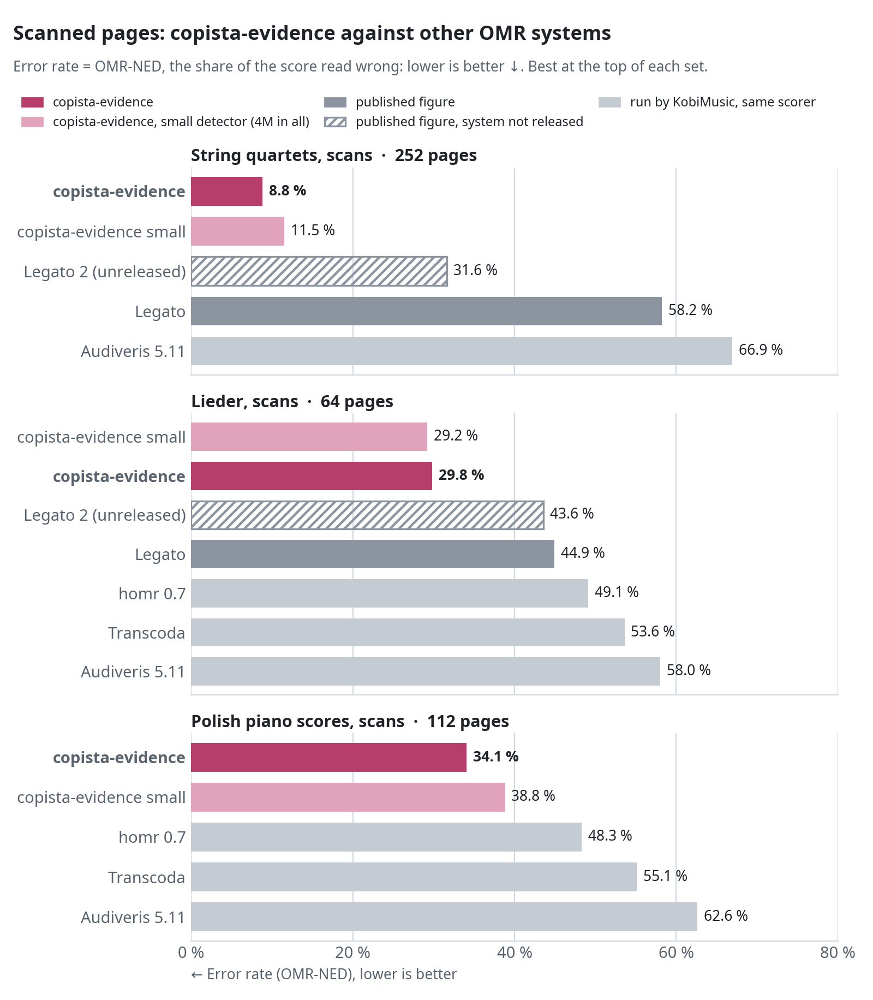
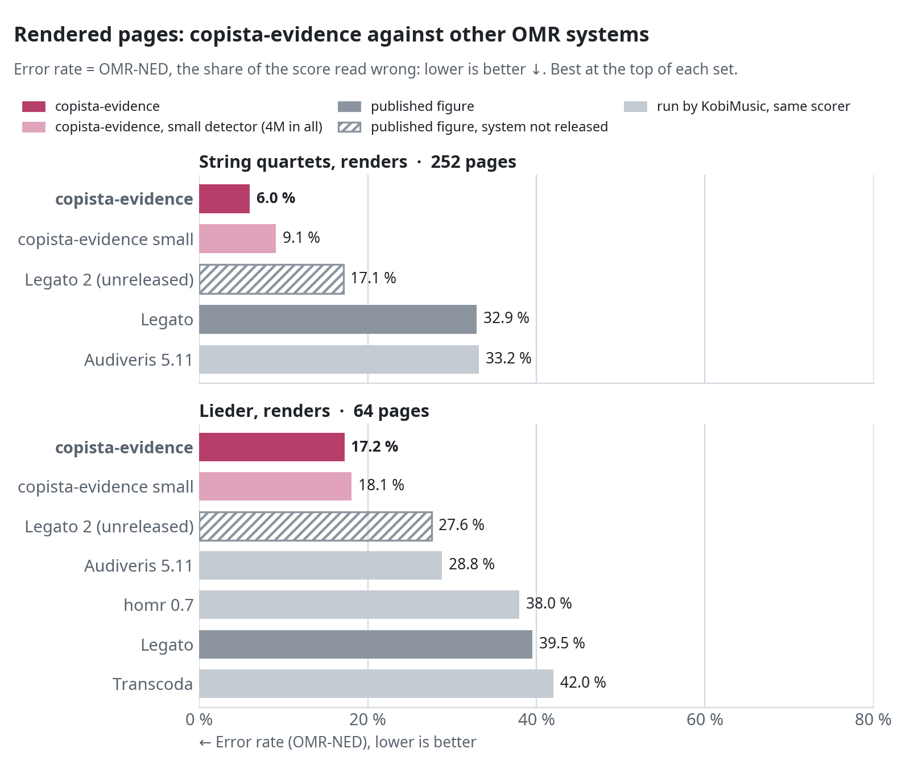

# copisteria

<p>
  <a href="https://huggingface.co/collections/kobimusic/copista-6ac3033f1a779b0c63ad41a9"><picture>
    <source media="(prefers-color-scheme: dark)" srcset="https://huggingface.co/datasets/huggingface/badges/resolve/main/model-on-hf-md-dark.svg">
    
  </picture></a>
  <a href="https://huggingface.co/kobimusic"></a>
  <a href="https://kobi.music"></a>
  
</p>

KobiMusic's **copisteria** optical music recognition reader: a scanned page of sheet music in, MusicXML out. Instead
of hand-written rules, a 2M-parameter transformer reads every symbol in the context of the whole page: the naturals
that say a key is wrong, the bars that add up to three beats under a 4/4 sign, the dot the repetitions have, the
voice that works as the first. Nobody wrote that evidence down; the model learned it from rendered pages where the
truth is known.

copisteria is the evidence model and the reader around it; the symbols come from a **copista** model's detector, in
two sizes: **copista-28m** (a 28.7M-parameter detector, the default) and **copista-2m** (a 1.94M-parameter detector:
about 4M parameters for the whole reader). Both read with the same evidence model.

**Made for real scans.** It is focused on real scans, not just synthetic renders with wrinkles: strong on authentic
scans of 1800s and 1900s editions, where other systems collapse (the charts below). It works for some handwritten
scores too; but if even you have trouble reading a page, it will too.

<picture>
  <source media="(prefers-color-scheme: dark)" srcset="docs/images/compare-scans-dark.png">
  
</picture>

## How it reads a page

1. **Detect.** A symbol detector finds every notation symbol on the page (270 classes) with the note heads'
   attributes (staff position, stem, dots, voice), at the size that puts the page's staff space at 10.6 px.
2. **Lay out.** A small front end decides only geometry: overlapping boxes of one family become one symbol (class
   posterior and probability of being real from the boxes' confidences), staves come from the staff lines in the
   ink, systems from the ink that joins staves at their left, bars from the bar lines most staves of a system show,
   and every symbol goes to its staff and bar. No music is decided here. Once the page is read, a voice that holds
   two bars' worth of its meter where a bar-line stroke stands gets that bar line, and the page is read again.
3. **Read in context.** The evidence model reads each system together with its neighbours. Every reading the
   detector has (real or not, class, dots, staff position, voice, grace) gets the model's *evidence* added to the
   detector's own log-probability, in nats: with no evidence, the detector stands. The rest is read from context:
   each note's sounding alteration, chord, tie, tuplet and onset in its bar, and each bar's clef, key and meter.
4. **Decode the meter, the rhythm and the accidentals.** The page's meter is decoded with its bars: each plausible
   bar length is tried through the rhythm decode, and the one the model's reading and the bars agree on is written,
   as not printed where the page prints none. Each voice's notes are placed at the onsets the model reads for them,
   and a voice's durations and tuplets are decoded jointly from the model's distributions, so one misread duration
   does not shift the rest of the bar. Each accidental glyph goes to its note and holds along its line to the bar's
   end, as notation defines it, unless the model is sure of another alteration.
5. **Write.** The readings are written as MusicXML, with beams, slurs, ties, articulations, dynamics and page text
   attached by position; a part's name is the text that sits beside its staves and names an instrument. Nothing is
   added that the detector did not see: time a bar's notes leave is written as a rest that is not printed, so every
   bar has its meter's length.

`docs/ARCHITECTURE.md` is the design document: the front end, the model, the writer and the training.

## Layout

| Folder | What it holds |
|---|---|
| `src/copisteria/` | The pipeline (`python -m copisteria.pipeline`), the front end, the evidence model and its reader, the writer, the viewer, the training loop, the benchmark runner |
| `src/copisteria/training/` | Training data: rendered pages to the model's tokens and targets |
| `src/copisteria/vision/` | Pages from images and PDFs, staff lines from the ink |
| `src/copisteria/detector/` | The symbol detectors' architectures |
| `models/` | The detectors' taxonomy; the weights go here. They are not in this repository. |
| `tests/` | The tests |
| `docs/ARCHITECTURE.md` | The design |

## Weights

The weights are public on Hugging Face, one repo per size, in the
[copista](https://huggingface.co/collections/kobimusic/copista-6ac3033f1a779b0c63ad41a9) collection:
[`kobimusic/copista-28m`](https://huggingface.co/kobimusic/copista-28m) and
[`kobimusic/copista-2m`](https://huggingface.co/kobimusic/copista-2m), each with its model card. The pipeline looks
for them here:

```
models/evidence-2m.pt                     # the evidence model (2.03M parameters), both sizes
models/small/v7_obj-recall-30m_best.pt    # copista-28m's detector (28.7M parameters)
models/small/v7_obj-recall_best.pt        # copista-2m's detector (1.94M parameters)
```

With the Hugging Face CLI (`pip install huggingface_hub`), from the repository's root:

```
hf download kobimusic/copista-28m --include "*.pt" --local-dir models    # evidence-2m.pt + copista-28m's detector
hf download kobimusic/copista-2m --include "*.pt" --local-dir models     # evidence-2m.pt + copista-2m's detector
```

## Install

Python 3.12, and poppler-utils (`pdftoppm`, `pdfimages`) for PDFs.

```
pip install -e .    # or: pip install -e ".[test]" for the tests
```

Install it editable and run it from the repository's root: the code finds `models/` there.

## Use

```
python -m copisteria.pipeline page.png --out out                  # copista-28m
python -m copisteria.pipeline page.png --out out --detector 2m    # copista-2m
python -m copisteria.pipeline --pdf score.pdf --range 1-12 --out out
```

Each page gives `<page>.musicxml`, `<page>.reading.json` (every symbol's reading: the detector's choice, the final
choice and the evidence for it) and `<page>.html`, a viewer: the scan with every symbol, the readings the context
changed (hover: what the detector said, what the model reads, and the symbols it looked at most), and the MusicXML
engraved by Verovio. `out/index.html` lists the pages read.

The detections are cached beside each page (`<page>.dets_v7_<size>.json` for copista-28m,
`<page>.dets_v7small_<size>.json` for copista-2m). Page text (title, composer, part names, tempo and expression
words, the counts over multi-measure rests) is read from `<page>.texts.json` beside the page when it is there: OCR
text boxes with their role on the page, `[{"text": ..., "xyxy": [x0, y0, x1, y1], "role": ...}]`
(docs/ARCHITECTURE.md lists the roles). Without it the music is read the same and the text is left out.

| Environment variable | What it does |
|---|---|
| `COPISTERIA_DETECTOR` | `28m` (default) or `2m`, or a detector checkpoint of the same 270 classes; `--detector` sets it |
| `COPISTERIA_ONSET` | `1` (default): notes at the onsets the model reads and rhythm decoded per voice; `0`: the read durations one after another |
| `COPISTERIA_ONSET_P` | The onset confidence a note needs to be placed at its own onset (default 0.6) |
| `COPISTERIA_RHYTHM` | `1` (default): durations and tuplets decoded jointly per voice; `0`: onsets only |

## Training

The model learns from rendered pages whose labels say what every symbol means in the score (pitch, alteration,
voice, onset, tie, tuplet, and the clef, key and meter of every staff): docs/ARCHITECTURE.md describes the format.
The released model saw 31,800 pages rendered from 28,000 [PDMX](https://zenodo.org/records/15571083) scores in
random engraving styles with scan effects; the renderer is not part of this repository.

```
python -m copisteria.training.tokenize data/pages data/tok        # the detector over every page, tokens and targets
python -m copisteria.train --data data/tok --out runs/evidence    # see train.py for the released model's recipe
```

## Tests

```
python -m pytest
```

## Benchmark

The OMR-NED benchmark: each page's MusicXML is compared with the dataset's own by [musicdiff](https://github.com/guang-yng/efficient-musicdiff/tree/646bef943f58aba093d467900908a3a455e1beed), the edits are summed
over a set and divided by the symbols of both scores. The result is the **error rate**, the share of the score read
wrong: a page read entirely wrong scores 100 %.

> **Every figure in the table and the charts is an error rate: lower is better ↓.** copista-28m is lowest on every
> set; both sizes are ahead of every other system on every set.

| System | Figures | Quartets, scans ↓ | Quartets, renders ↓ | Lieder, scans ↓ | Lieder, renders ↓ | Polish piano, scans\* ↓ |
|---|---|---|---|---|---|---|
| **copista-28m** | KobiMusic | **8.7 %** | **5.8 %** | **17.7 %** | **14.6 %** | **34.4 %** |
| **copista-2m** | KobiMusic | 11.2 % | 8.8 % | 17.8 % | 15.9 % | 38.7 % |
| Legato 2 (unreleased) | published | 31.6 % | 17.1 % | n/a ⁴ | 27.6 % | n/a |
| Legato | published | 58.2 % | 32.9 % | n/a ⁴ | 39.5 % | n/a ¹ |
| homr 0.7 | run by KobiMusic | piano only | piano only | 42.3 % | 38.0 % | 48.3 % |
| Audiveris 5.11 | run by KobiMusic | 66.9 % ² | 33.2 % | 51.8 % | 28.8 % | 62.6 % |
| Transcoda | run by KobiMusic | piano only | piano only | 48.4 % ³ | 42.0 % ³ | 55.1 % ³ |

Pages per set: quartets 252 scans and 252 renders, Lieder 55 scans and 64 renders, Polish 112. The Lieder scans are
the dataset's 64 less 9 broken pages (0032-0035 and 0048-0052): their ground truth lacks the vocal staff the page
shows, so every system loses most of them. copista-28m is the 28.7M-parameter detector with the 2.03M-parameter
evidence model (30.7M in all), copista-2m the 1.94M-parameter detector with the same evidence model (4.0M in all);
the evidence model was trained on copista-28m's detector. "Published" figures are the ones in the Legato papers
([Legato](https://arxiv.org/abs/2506.19065), [Legato 2](https://arxiv.org/abs/2607.05769)). **Legato 2 is not
released**: its figures are from the paper and nobody can run it (hatched bars in the charts). The systems marked
"run by KobiMusic" were run on the same pages with the same scorer. A page a system gives no output for counts as
read entirely wrong, as on the IMSLP piano leaderboard.

\* **Polish scans:** the ground truth holds notes, rests, beams and tuplets only: no slurs, pedal marks, dynamics,
octave lines or text, and almost no articulations (0.4 per 100 notes, against 5-19 in the other sets). Whatever a
reader reads of those counts against it, and copisteria reads them: about 2.7 points of its error. Scored on notes
and rests only, copista-28m's error rate is 28.2 % and copista-2m's 33.4 %. The comparison with the other systems
stands: they are scored against the same ground truth.

1. Legato's Polish figure (86.7 %) comes from a different pipeline and carries an asterisk where it is published; it
   is left out.
2. Audiveris gave no output on 54 of the 252 quartet scans. Its pages were upscaled for it (it refuses small staff
   spacing); our Audiveris runs score far better than the Audiveris figures published in the Legato 2 paper.
3. Transcoda writes `**kern`; it is scored against the same MusicXML ground truth as the others (against the
   dataset's kern ground truth its Polish figure is 51.6 %).
4. Legato and Legato 2 publish their Lieder scan figures over all 64 pages (44.9 % and 43.6 %), the 9 broken pages
   included, so they have no figure on these 55.

<picture>
  <source media="(prefers-color-scheme: dark)" srcset="docs/images/compare-renders-dark.png">
  
</picture>

**copisteria alone.** Over the 735 pages of the five sets copista-28m reads 88.3 % of the score right (error rate
11.7 %), copista-2m 85.5 % (14.5 %). A known weakness: triplets a page does not mark (marked once, often pages
earlier), which it can read as plain notes.

The figures are this code's run with `evidence-2m.pt` and the default settings (`--detector 2m` for copista-2m),
with page text from KobiMusic's OCR (Tesseract) in `<page>.texts.json`; `python -m copisteria.omrned <set
dir>` reads a set. `docs/images/make_charts.py` draws the charts.

## Links

| | |
|---|---|
| 🤗 [copista](https://huggingface.co/collections/kobimusic/copista-6ac3033f1a779b0c63ad41a9) | The weights: [copista-28m](https://huggingface.co/kobimusic/copista-28m) and [copista-2m](https://huggingface.co/kobimusic/copista-2m), with their model cards |
| 🤗 [kobimusic on Hugging Face](https://huggingface.co/kobimusic) | KobiMusic's models |
| [kobi.music](https://kobi.music) | KobiMusic, with the hosted reader |
| [efficient-musicdiff](https://github.com/guang-yng/efficient-musicdiff) | The OMR-NED scorer |

## License

The copisteria code is released under the [Apache License 2.0](LICENSE). You may use, change and redistribute it,
commercially too, as long as you keep the copyright notice and the [NOTICE](NOTICE) file that credits KobiMusic, and
mark the files you changed.

## Citation

If you use copisteria in research or in a product, please cite it:

```bibtex
@software{copisteria,
  author  = {{KobiMusic}},
  title   = {copisteria: optical music recognition with a learned evidence model},
  year    = {2026},
  version = {1.3.0},
  url     = {https://github.com/kobimusic/copisteria},
  license = {Apache-2.0}
}
```
